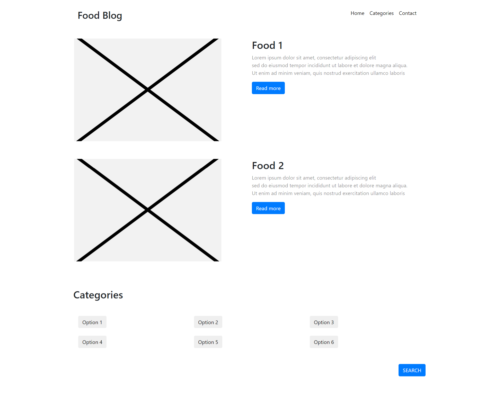

# This is a demo of your submission

## Files included

- HTML file ([food_blog_demo.html](https://github.com/dunmanhigh/web_templates/blob/main/Blog/Demo%20Food%20Blog/food_blog_demo.html))
- Image of your sketch ([food_blog_demo_sketch.jpg](https://github.com/dunmanhigh/web_templates/blob/main/Blog/Demo%20Food%20Blog/food_blog_demo_sketch.jpg))
- Optional: Amended HTML file ([food_blog_demo_amended.html](https://github.com/dunmanhigh/web_templates/blob/main/Blog/Demo%20Food%20Blog/food_blog_demo_amended.html))

## Why is Amendment necessary?

Sketch2Code is not perfectly accurate

 

As you can see, Sketch2Code did not include the navigation bar, certain title, and a few buttons. I may also want to change the CSS to make the page look closer to my sketch.

After amendment, it looks much better and is closer to the sketch.

However this is not necessary if you are unfamiliar with HTML. It is just a bonus :)
