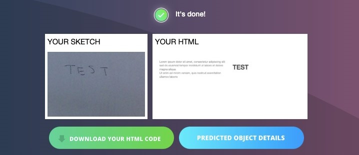
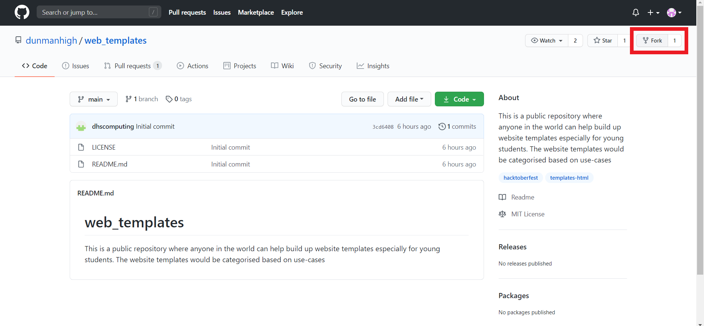
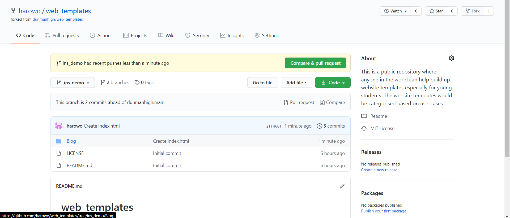
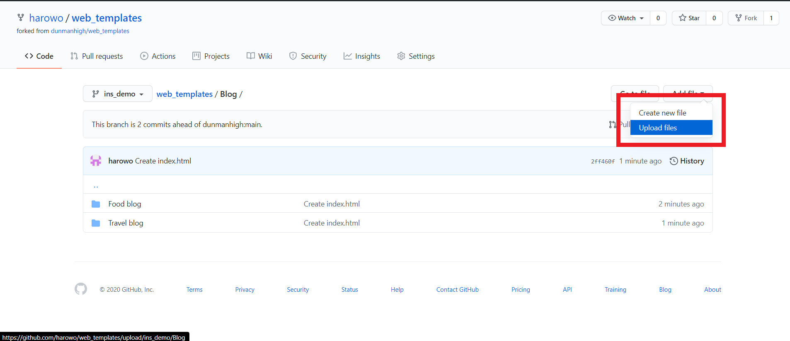
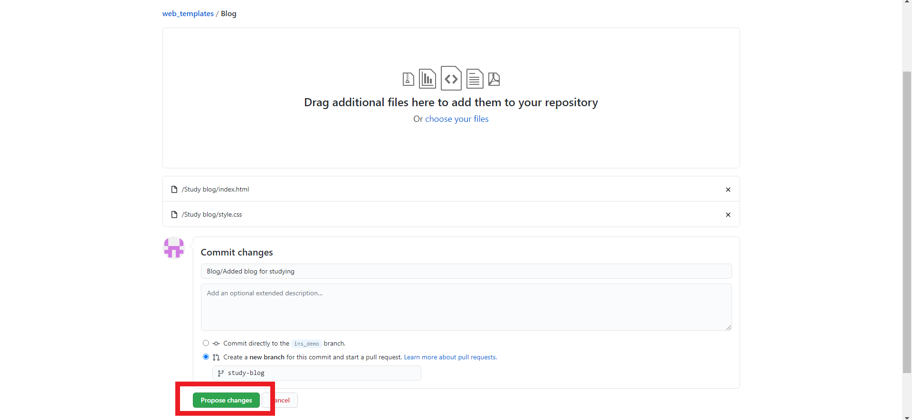
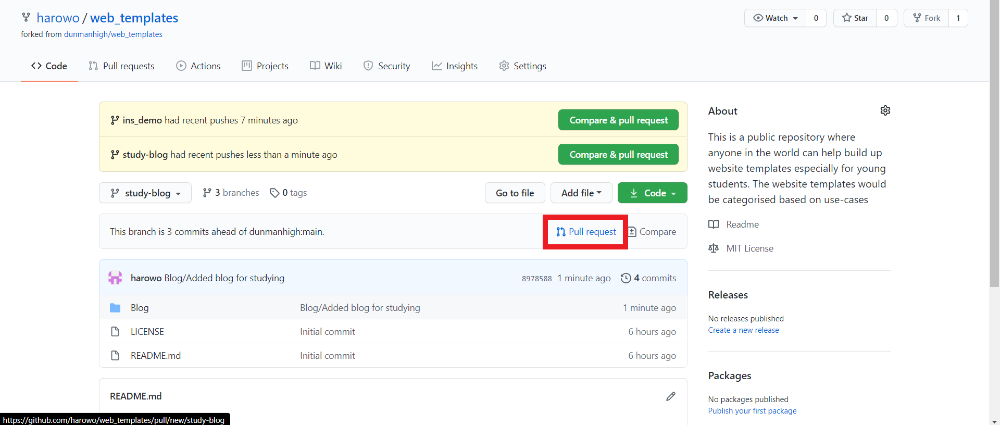
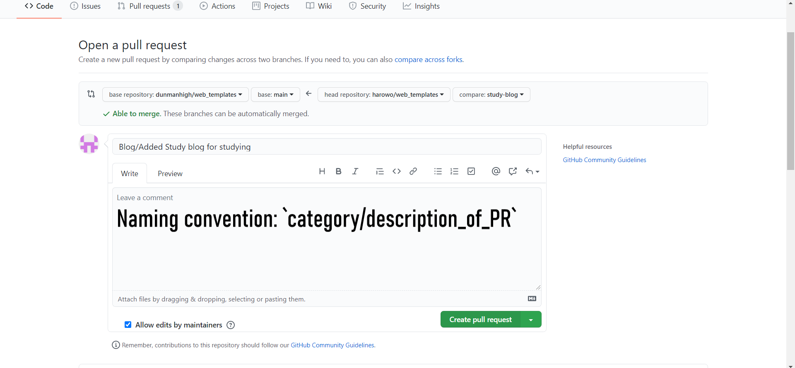
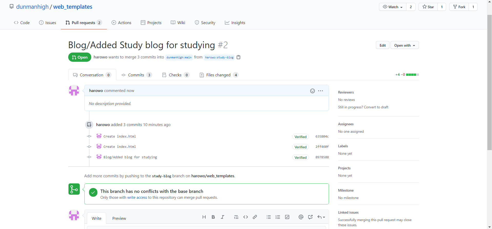

# Contributing Instructions

## Design Categories

- Tributary
- Blog
- Web Survey
- News app
- Result Summary
- Weather app
- Web Article

## Requirements

- Github account
- Folder (named appropriately) with HTML and CSS file, as well as a picture of your sketch. (CSS file is optional)

# Submission

## For Beginners

---

## Reference Resources

### HTML

- [HTML Introduction](https://www.w3schools.com/html/html_intro.asp)
- [HTML Element References](https://www.w3schools.com/tags/)

### CSS

- [CSS Introduction](https://www.w3schools.com/css/css_intro.asp)
- [CSS References](https://www.w3schools.com/cssref/)

---

## Instructions

### Sketch2Code

1. Draw your design out on paper
2. Use <https://sketch2code.azurewebsites.net/> to convert your design into html code
    - Method 1: Take a picture of your design with your phone and email it to yourself. Download the image onto the computer to upload the design
    - Method 2: Use the webcam to take a photo of your design

      

3. Download your HTML code, check for mistakes (Open with Notepad++) and proceed to the next section of creating the Pull Request

    

    *Optional: Add or change the CSS of your HTML file*

### Creating the Pull Request

1. Fork the project

    

2. Go to your profile and open the forked repository. Navigate to the folder you are going to upload your files into.

    

3. Click on `Add file` and then `Upload files`

    

4. After uploading, select `Create a new branch` and `Propose changes`

    

5. Return to your forked repo and start a `Pull request`

    

6. **Important:** Make sure you are comparing from your newly created branch to the `main` branch of `dunmanhigh/web_templates`.

    Also follow `category/description_of_PR` when naming your pull request.

    

7. When you see this under Pull requests tab in the base repo, your pull request has successfully been created. Wait for it to be accepted.

    

8. You're all set with the pull request! The next set of advanced instructions won't be needed for class.

## Advanced (Git)

### Creating the Pull Request

1. Fork the project
2. Create a new branch (`git checkout -b "new_contribution"`)
3. Commit your change (`git commit -m "Added new template"`)
4. Push to your branch (`git push origin "new_contribution"`)
5. Return to Github and open the pull request

**Important:** Naming Convention:`category/description_of_PR`
